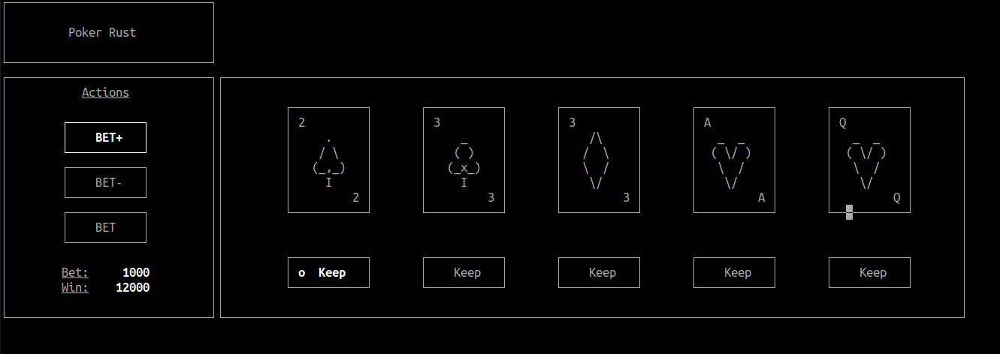

# Poker

## Description

A 5-card draw poker game (CLI) built from scratch with Rust.

## Installation

:warning: Code is written for Linux only.

## Build

1. Clone this repository
2. Compile with `cargo build --release`
3. Run with `cargo run --release`
